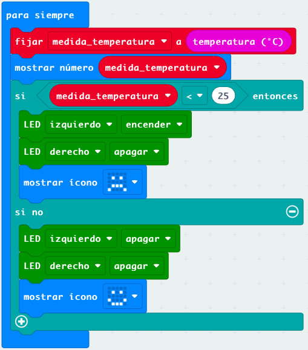

## Ejemplos

## Dado con imágenes

[Proyecto](https://makecode.microbit.org/_YJhPu47syfjs)

* Radio:
    Fundamental establecer el mismo ID para las microbit del mismo grupo

    * Dado en grupo usando radio. Todas las micro:bit tienen el mismo programa y emiten y reciben datos por radio. Creamos una función para mostrar las caras del dado tanto al recibirlos como al agitarlos y emitirlos. [Proyecto](https://makecode.microbit.org/_RRT0tffa7YVY)
    

    * Control de maqueen por radio

[Receptor v1](https://makecode.microbit.org/_iY0EY3cma9kf)

Si usamos el mismo id de grupo en varios maqueen podemos moverlos como si hicieran una coreografía

* Funciones para el movimiento de maqueen que podemos reutilizar como "librerias" [Proyecto](https://makecode.microbit.org/_aMKidVTHAUoJ):

Definimos las funciones de movimiento:

* Adelante
* Atrás
* Derecha
* Izquierda 
* Parar

* Calibramos tiempos para giros de 90 grados y movimientos de 50 cm

## Termostato

Vamos a usar variables para guardar la medida de sensores. De esta manera nos aseguramos usar el mismo valor a lo largo del programa y evitamos tomar más medidas de las necesarias.

Un termostado sencillo sería

## Termostato: leds en P8 y P12 

Vamos a simular un sistema de calefación usando los leds que trae el robot maqueen, encendiendo uno u otro según la temperatura

[Termostato con leds](https://makecode.microbit.org/_4gYWeheaTbmk)

## Ventilador inteligente (smart fan)

Vamos a hacer un proyecto donde usaremos uno de los motores de maqueen como si fuera un ventilador

[Smart Fan](https://makecode.microbit.org/_T9Lc3KFcWLtC)

También haremos que se muestre la temperatura si pulsamos el botón A

## Personalidades para maqueen

Podemos dotar a maqueen de personlidades usando sus sensores, por ejemplo usando el sensor de Ultrasonido podemos hacer que se comporte como un robot tímido si se aleja al acercarnos o curioso si nos sigue

[Sígueme maqueen](https://makecode.microbit.org/_TiLXLd9v8KPi)
