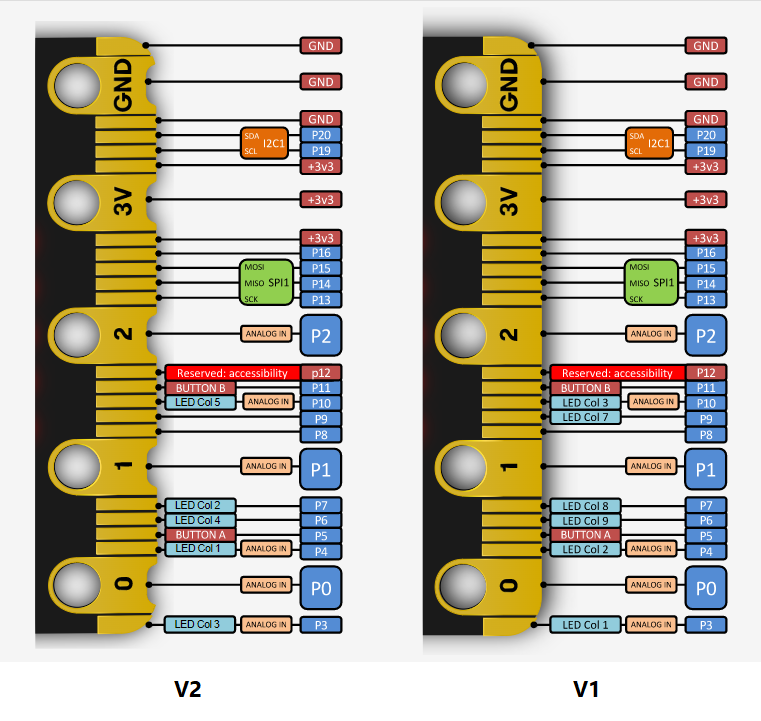

## Usos de pines

Vamos a ver el uso directo de los pines de la micro:bit, normalmente usaríamos una extensión que los maneja, pero en esto ejemplos vamos a trabajar directamente con los bloques de la paleta Pines.

## Pines micro:bit

[Detalles sobre los pines](https://makecode.microbit.org/device/pins)

[Más detalles sobre los pines](https://tech.microbit.org/hardware/edgeconnector/)

Hay pines digitales, analógicos, PWM, comunicaciones...

### Salidas digitales

Podemos activar o desactivar los pines de un modo digital, es decir todo o nada.

Vamos adaptar el termostato que hicimos con los leds de maqueen usando el bloque "Escritura digital" de la paleta "Pines"

Para ello vemos en la parte de abajo del robot maqueen que los leds corresponden a los pines 8 y 12

[Proyecto Termostato Leds](https://makecode.microbit.org/_WCTLDg0EwMTe)

### Sensores analógicos

La mayoría de sensores analógicos que usamos se basan en genera un voltaje proporcional a la medida que queremos determinar. Con la micro:bit mediremos el voltaje que hay entre los pines GND y S del sensor, almentándolo también con GND y V. Normalmente funcionan a 3V.

Para leerlos usaremos el bloque "lectura analógica" que nos da un valor entre 0 y 1023, correspondiente a 0V y a 3V

### Salida "analógicas" - PWM

Aunque la micro:bit no tiene salidas analógicas reales, podemos simularlas en algunos pines, de manera que si conectamos un LED  a uno de los pines ¿P0, P1, P2, P3, P4 o P10? podemos conseguir modular su brillo

Para ello usaremos el módulo "Escritura analógica" indicando una "potencia" o "brillo" para el led entre 0 y 1023, 0 significa totalmente apagado y 1023 sería máximo brillo.

En este sencillo programa hacemos un ciclo de brillo creciente (Fade in) y luego uno decreciente (Fade out)

Se ha limitado hasta 100 para ver más claramente el cambio de brillo, si subimos cerca de los valores máximo el ojo ya no distingue el cambio.

Este tipo de control de potencia se llama PWM (Pulse Width Modulation), y consigue controlar la cantidad de energía transferida modulando el estado de pin con una cierta frecuencia, creando un pulso cuyo ancho es proporcional a la potencia que queremos transmitir

Como vemos en la imagen, cuando más tiempo está la señal en estado alto, es mayor el brillo del led.

**Led de potencia (3W)** se trata de un led de ilumninación de los que se usan en las bombillas LED que incluye en el módulo toda la electrónica necdesaria para que un pin de la micro:bit pueda controlar su brillo

## Encendiendo los Leds de maqueen con botones

[v1 los botones encienden 
leds](https://makecode.microbit.org/_XoChXwfF12HJ)

## Eliminar extensiones o componentes no utilizados

1. Cambiamos a código Javascript

2. Pulsamos en explorar

3. Podemos eliminar las que tienen el icono de la papelera

4. Se elimina la extensión

### Encender led de maqueen (P8) con pulsador A (P5)
 
Con eventos:
 

Polling

Uno con polling otro con eventos

[v2 funciones sin extensión 
maqueen](https://makecode.microbit.org/_PvpeE5gtCRfu)

## Apagamos los leds pasados 5 segundos

Usamos una variable para almacenar el estado de los leds (también podíamos ver el estado con el bloque "lectura digital" del pin correspondiente)

[V3 autoapagado](https://makecode.microbit.org/_hcuAMWasM12a)

