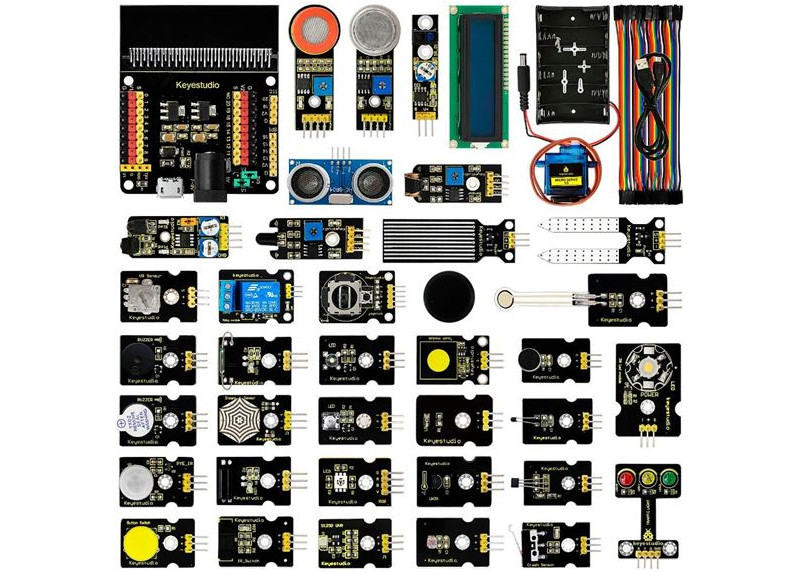
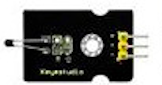
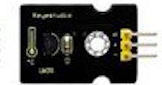
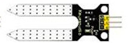
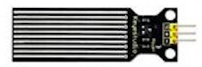
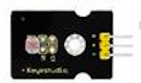
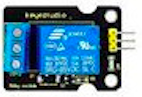
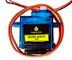
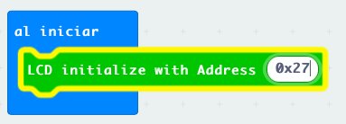

## Kit avanzado

[Kit avanzado](https://tienda.bricogeek.com/microbit/1686-starter-kit-sensores-37-en-1-para-microbit.html)

[Wiki del kit](https://wiki.keyestudio.com/KS0361(KS0365)_keyestudio_37_in_1_Starter_Kit_for_BBC_micro:bit)

[Extensor](https://tienda.bricogeek.com/microbit/1706-keyestudio-shield-para-sensores-v2-para-microbit.html)

**Sensor de temperatura PTC**

**Sensor con medida lineal de temperatura LM35**, medimos el voltaje y con una sencilla operación determinamos la temperatura

**Sensor de humedad de suelo** nos permite medir la humedad del suelo midiendo la conductividad entre sus dos "patitas" al introducirlo en la tierra

**Sensor de nivel de agua o de lluvia** dependiendo de la candidad de agua que toque sus pistas produce una señal diferente 

**Sensor de nivel de luz** que nos da un voltaje proporcional al nivel de luz recibida. No está calibrado y la medida no tiene una medida concreta.

### Actuadores

**Relé** permite controlar cargas eléctricas de potencia (2500W en el caso de este) electrónicamente

Funciona digitalmente

Los **servos** son motores que incluyen la electrónica necesaria para controlar su movimiento. Suelen permitir un movimiento angular limitado a unos 180 gracos.

Para controlarlos usaremos una extensión que nos proporciona bloques para establecer su posición.

Las **pantallas LCD** nos permiten mostrar datos de una manera muy sencilla. La conexión es entre los pines SDA y SCL de la pantalla y los 19 y 20 de la microbit.

Para controlarla usaremos la extenxión **I2CLCD**, recordando que debemos inicializarla añadiendo el bloque "LCD inicialize" indicando la dirección de nuestra pantalla, que nos proporcionará el fabricante (suele ser una de estas 0x27, 0x3E, 0x3F)

