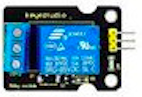

## Proyectos

Veamos algunos proyectos a realizar con micro:bit

## Sistema de Riego

Se trata de un sistema que riegue nuestra plantas de manera automática. 

Vamos a realizar distintas versiones, empezando por las más sencillas

### Riego v1 - Temporización

Sistema de control de riego más sencillo, simplemente se activa cada cierto tiempo y con una duración concreta.

Es tan sencillo que se podría hacer sólo con electrónica, sin necesitad de placa controladora.

### Riego v2 - Medida de humedad

En esta versión determinamos la humedad del suelo y si está por debajo de cierto valor encendemos el riego

Lo apagaremos cuando se alcance el valor de humedad establecido.

Para determinar estos valores de humedad (umbrales) hacemos un proceso de **calibración** en situaciones reales

### Iluminación

Es totalmente equivalente al anterior pero usando un sensor de luz (LDR) 

y un LED para iluminar

Podemos encender el led de forma digital o progresivamente usando PWM

### Calefacción

En este proyecto usamos la típica programación del termostato, encendiendo o apagando con un relé el sistema de calefacción

## Estación meteorológica

Se trata de un sistema que utilizando un sensor de temperatura y humedad, DHT11, muestra los resultados en una pantalla LCD 

Conexión de componentes: 

* micro:bit
* Extensor
* lcd
* sensor de temperatura

[Ejemplo con LCD y sensores](https://makecode.microbit.org/_D0wECTdkHMK5)

LM35 o DHT11 + LCD

## Proyecto: Rover marciano

Se trata de crear un rover marciano que podemos controlar remotamente, que nos envía datos y que ademas es capaz de reaccionar ante obstáculos. 

Necesitamos 2 micro:bit, una para el mando y otra con maqueen.

Haremos 3 versiones:

0. Funciones de control de maqueen. Vamos a definir una serie de funciones para facilitar el uso de maqueen:

1. Control remoto de maqueen vía radio. Usaremos los botones y el logo para enviar órdenes usando caracteres/cadenas

2. Añadimos el extensor y conectamos un pulsador en P1 para ampliar el mando

Conectamos un servo en el S1 de maqueen. El servo hará un barrido entre 0 y 180

3. El rover enviará datos que el receptor mostrará.

El rover envía la temperatura vía radio cada segundo como número. 

[Proyecto rover v3](https://makecode.microbit.org/_bxcEpVUyTXCv)

El receptor mostrará los datos en un LCD que hemos conectado vía I2C (pines 20-SDA y 19 SCL)

Añadimos la configuración del LCD (Address 0x27=69)

Añadimos una tarea cada segundo que mostrará en la fila 0 del LCD la temperatura del mando

Cuando recibamos datos numéricos del rover los mostramos en la fila 1

[Proyecto mando v3](https://makecode.microbit.org/_EADA3w304YCR)

