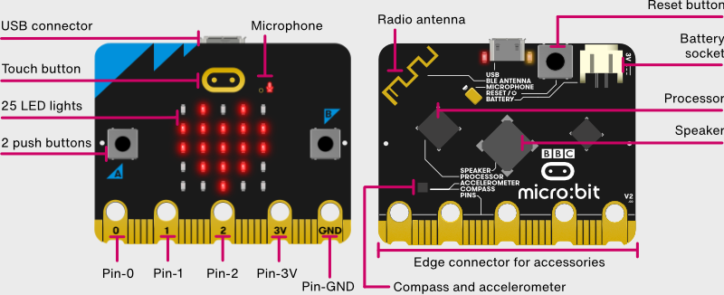

# micro:bit

Se trata de una placa pensada para aprender programación y robótica desarrollada muy recientemente aprovechando los avances de un montón de proyectos anteriores y aprendiendo de sus errores

La última versión, la micro:bit v2, incorpora un potente procesador dotado de suficiente memoria para poder trabajar con lenguaje moderno con Python

Al mismo tiempo incorpora sensores como un acelerometro una brújula digital un sensor de temperatura sensor de luz una pantalla de 25 LED que podemos encender y apagar individualmente graduando la intensidad de cada uno de ellos dos pulsadores un micrófono y un altavoz

Todo ello que el paquetado en un formato pequeño cómodo de usar y sobre todo muy barato

Desarrollado por una fundación sin ánimo de lucro han reducido muchísimo el precio actualmente ya existen clones que se pueden encontrar aún más baratos en las típicas tiendas orientales

El ser muy compacta y estar dotada de un gran número de sensor encontrado en la propia placa la hace ideal para trabajar en todas las edades

### Programación

Podemos programar la de muchas formas diferentes utilizando lenguaje de bloques utilizando faito o programando la directamente con el ID en programación con Arduino

El poder trabajar con ella en diferente al lenguaje nos permite el graduando la dificultad y el entorno utilizado en cada una de las distintas

### Programación con bloques y luego código
Podemos iniciarnos utilizando bloques y desde el primer día aprovechando toda su potencia para continuar haciendo programación más compleja a medida que van cogiendo experiencia un mismo dispositivo lo podemos utilizar durante diferentes niveles con diferentes entornos

### Comunicaciones innalámbricas
Además está dotado de un sistema de conexión por radio compatible con bluetooth y que también puedan utilizar en comunicación directo entre las diferentes microbits lo que le hace muy cómoda para trabajar sin ninguna infraestructura externa es decir simplemente teniendo varias microbis podemos trabajar con ella simultáneamente

### Recursos disponibles
El hecho de que esté desarrollada por una **fundación sin ánimo de lucro** ha permitido el desarrollo de una enorme cantidad de **recursos gratuitos** que están accesibles sobre todo orientado a la formación stem

### Multitud de sensores incorporados
El que incluyan todos estos sensores la propia placa la hace ideal para trabajar aplicaciones de tipo estén en la que nos independizamos un poco más de las típicas aplicaciones informáticas para aprender conocimientos relacionados con la física ingeniería o la biología

### ¿Cuánto tardo en hacer mi primer proyecto con micro:bit?
Mientras que en otras plataformas como puede ser Arduino el típico hola mundo que hacemos el primer día nada más que utilizar nuestra placa microbit puede ser un cuenta paso juzgado que muestra aleatoriamente diferente resultados fufú sencillo juego que se muestra la pantalla

## Proyectos
Si buscamos entre los diferentes proyectos compartidos online podemos encontrar proyecto pensado para que lo usuario alumno muestren sus sentimientos utilizando distintos emoji que aparecerán en la pantalla no tenemos que ceñirnos a un aprendizaje de las técnicas de cirugía robótica sino que lo podamos incorporar como un recurso más dentro de cualquier otra asignatura

Por si todo esto fuera poco también podemos incluir como una extensión a la micro bit dentro de Nacha plicaciones scratch lo que no facilita enormemente el utilizarla como un mando en el sistema dándole a una mayor versatilidad e incorporando la directamente dentro de lo que serían nuestras aplicaciones del ordenador

## Complementos
Hasta ahora solamente hemos comentado lo que son las aplicaciones de la placa en sí misma pero podemos ampliar la mente sin límite utilizando los distintos conectores que incorpora así podremos trabajar con otras placas que nos van a facilitar la conexión de distintos periféricos que incorporaremos nuestro sistema teléfono más compleja controlando motores controlando servo controlando distintos tipos de sensores cómo haríamos en cualquier otro proyecto informático

O bien podemos conectar las típicas pinzas cocodrilo que nos van a facilitar enormemente ducho cuando estamos trabajando en la edad más temprana utilizándola como la conocida placa meki meki

## Proyectos

Cómo hacer el típico proyecto de **comprobar el pulso** que tenemos utilizando una micro bit para ello como a conectar simplemente un cable qué hace la forma compleja porque tenemos que pasar con nuestro anillo y por el otro elemento la otra pinza lo conectamos una de las pastillas que en el caso en el que hagan contacto entre sí y tardar

Podemos **detectar un terremoto** con una micro bit podemos usando el acelerometro detectar cuando las vibraciones están por encima de un umbral y marcarlo como que se ha producido un terremoto

**Enciéndete cuando hago palmas**

Una palmada enciende dos formada apaga

### Domótica con micro:bit
¿Que necesitaríamos para conectar nuestra micro bit y utilizarla como un dispositivo domótico? simplemente podríamos controlar lo que se conoce como un relé que podemos definir como un interruptor electrónico que accionado por las pequeñas potencias que controla la microbis es capaz de controlar un dispositivo de mayor potencia cómo puede ser una bombilla

## Ejercicios iniciales

1. Cómo a comenzar mostrando en la pantalla de noche microbit unos números

2. Vamos a mostrar nuestro nombre en pantalla

3. Vamos a marchar ahora distinto emoji que podemos representar utilizando los que se han incorporado a nuestra microbit

4. Vamos a hacer nuestros propios dibujos que podemos representar y mostrar en pantalla