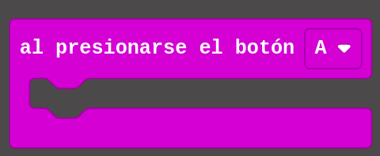
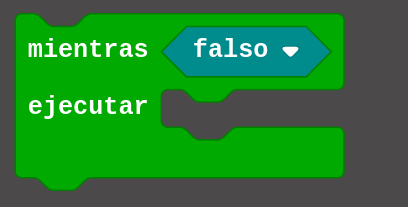
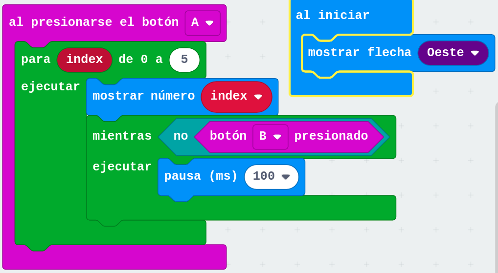

# Deteniendo nuestro programas hasta que se pulse un botón

Una de las preguntas más habituales que hacen los alumnos cuando ya se manejan con Scratch o con los bloques de micro:bit es cómo hacer que mi programa se detenga hasta que se pulse un botón o una tecla.

Estamos acostumbrados a trabajar en estos entornos con eventos y se nos olvida que también podemos usar otras formas de detectar pulsaciones.

Hay 2 formas de detectar las pulsaciones (de los botones o de los pines):

* Con **eventos**, que es como lo hacemos normalmente, y donde se genera un nuevo hilo de programa con nuestro bloques

* Desde dentro de nuestro programa con bloques condicionales. También podemos detectar si un botón está pulsado con este bloque condicional  (recordad que la forma hexagonal era para condiciones)

Para esperar hasta que se presione, podemos usar el bucle Mientras:

Y como lo que queremos es que espere hasta que se pulse, tendremos que hacer que espere "mientras no esté pulsado", es decir negar la condición, para lo que usaremos el bloque de operador lógico No (Not) 

Poniendo dentro la condición de "Botón B presionado".

En este sencillo [programa](https://makecode.microbit.org/_C6g53V7EvhRC) vamos a contar de 0 a 5 cuando pulsemos el botón A, mostrando cada número hasta que se pulse el botón B. Quedará así:

[Vídeo: Deteniendo la ejecución de un programa en la micro:bit hasta que pulsemos un botón](https://youtu.be/tCFltkD2VBg)

