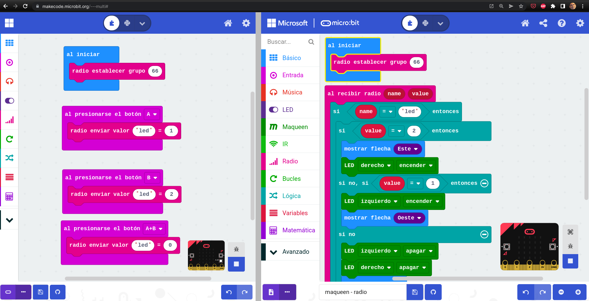
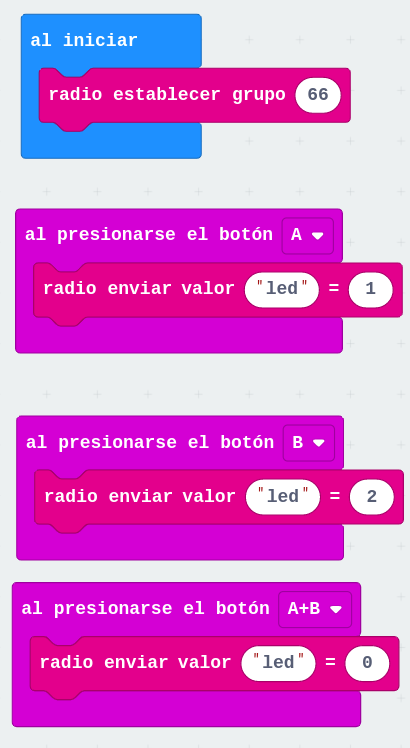
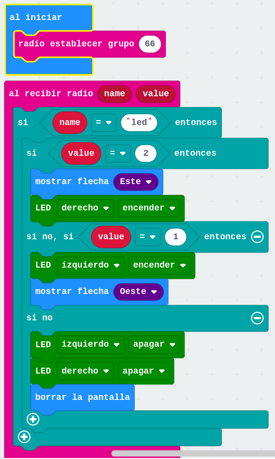

## Controlando un robot maqueen con otra micro:bit comunicándolos con radio

Vamos a hacer un ejemplo sencillo en el que controlaremos un robot maqueen con otra micro:bit comunicándolos con radio.

Vamos a usar el editor en modo «multi» que nos permite simular las comunicaciones de radio para hacer 2 programas al mismo tiempo:

El mando que enviará comandos usando pares «Nombre» – «Valor» (o etiqueta-valor, como se suele decir)
El receptor que al recibir los comandos los ejecutará en el maqueen
Para trabajar con la radio y poder probar las comunicaciones usaremos el editor MakeCode en modo «multi» desde https://makecode.microbit.org/—multi# lo que nos permite trabajar con 2 programas al mismo tiempo y que están «conectado» entre sí, es decir, lo que enviemos por radio en uno lo recibo el otro.

Vamos a empezar haciendo un ejemplo sencillo que controlará los 2 leds delanteros de maqueen con los botones de la micro:bit del mando: Al pulsar cada botón enviaremos los distintos valores del par nombre-valor llamado «led». En el receptor, en función del valor que recibamos haremos lo siguiente:

led = 2, encendemos el led derecho y mostramos una flecha apuntando al este
led = 1, encendemos el led izquierdo y mostramos una flecha apuntando al oeste
led = 0, apagamos los dos leds y borramos la pantalla. (mostramos algo en la pantalla del receptor para poder ver su funcionamiento en el simulador)
Por radio también podemos enviar valores numéricos o texto, pero si usamos estos pares nombre-valor podemos «estructurar» mejor nuestro programa, asignando distintos valores para los diferentes comandos, por ejemplo, «led» para controlar los leds, «Mov» para controlar cómo movemos maqueen, «rgb»,… Los nombres de estas etiquetas tienen una longitud máxima de ¿8? caracteres.

Para que las dos tarjetas se comuniquen tenemos que hacer que ambas estén en el mismo grupo de radio. Esto nos permite tener varios grupos de micro:bit funcionando sin interferencia entre ellas. Para ello asignamos el número de grupo en el bloque «al iniciar».

En el programa del mando añadiremos bloques que envíen los distintos pares nombre-valor según los botones pulsados

[Programa del mando](https://makecode.microbit.org/96829-29053-04575-80042):

En el programa de maqueen, al recibir los disintos pares por radio irá haciendo las distintas acciones.

[Programa de maqueen](https://makecode.microbit.org/93376-18938-01910-95502):

Descargamos cada programa a la correspondiente micro:bit y ya tenemos nuestra primera versión del mando de maqueen

A partir de aquí podemos añadir más comandos, por ejemplo controlando el moviendo usando el acelerómetro del mando.

[Vídeo con el proceso de creación de los programas](https://youtu.be/CnNRmd5GGWc)

