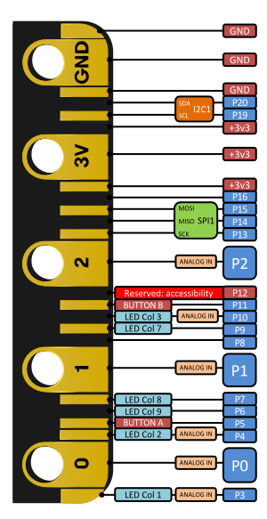

# Trabajo de clase

## Introducción a la robótica

Partes de un robot

¿habéis visto alguno?

## Placa

* Correspondencia con un robot
* Componentes de la placa

[Hardware](https://tech.microbit.org/hardware/)

## Ejemplos

Descripción del entorno

### En el IDE

* Display

1. Caritas
1. Iconos
1. Textos

* Eventos

1. Botones
1. Touch

* Acelerómetro

1. Dado

### Programación de la placa

1. Dados
1. Caritas

* Sonido

### Condicionales

1. Piedra, papel o tijera
1. Micro

## Pinout

v2

v1

[Detalles](https://tech.microbit.org/hardware/edgeconnector/)

Es openSource [Esquema electrónico](https://tech.microbit.org/hardware/schematic/)

