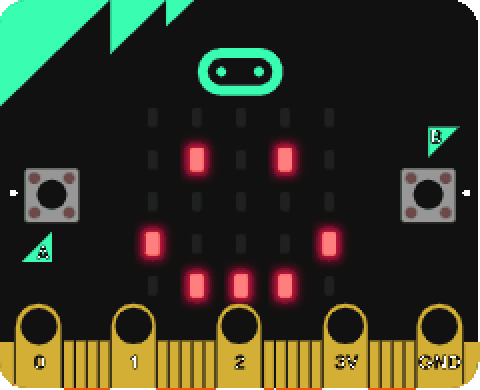
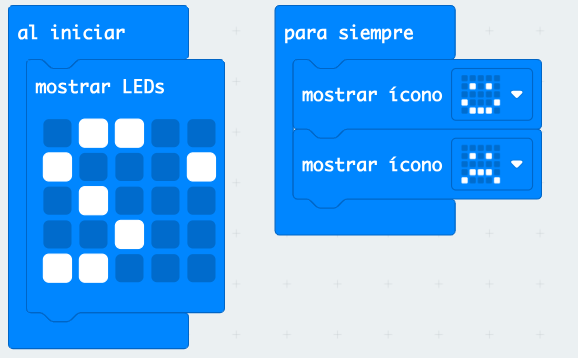
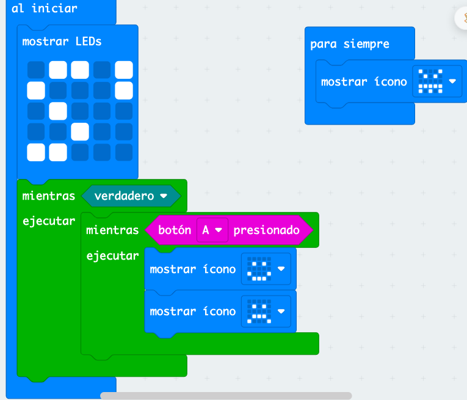
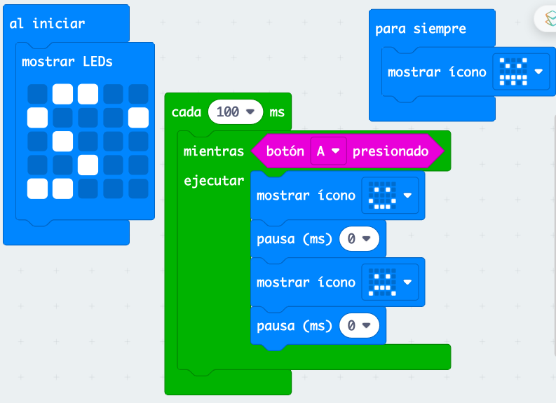
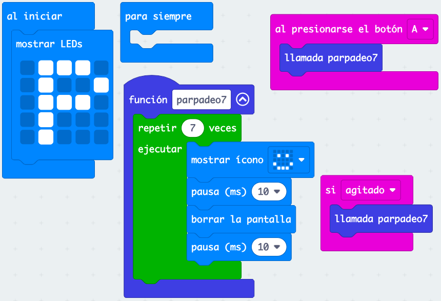
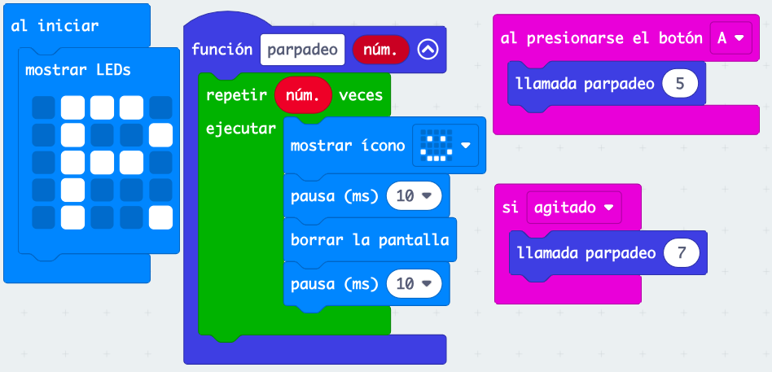
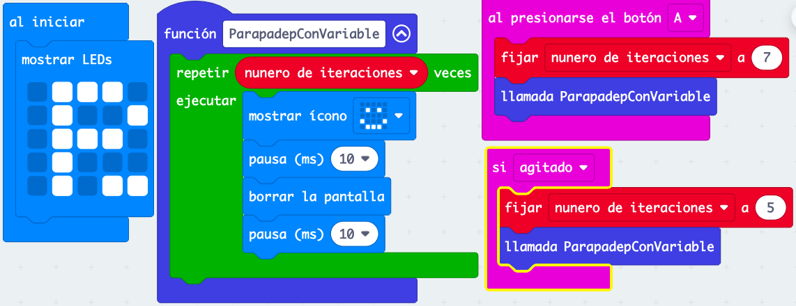

# Sesión 1 - Programación avanzada

## Cambios en Makecode entorno de programación

* Ahora permite que usemos una cuenta de usuario para almacenar nuestros proyectos
* Es más sencillo de emparejar micro:bit con el entorno
* Se ve una barra de progreso mientras se descarga el programa a la placa

## [Parpadeo sencillo](https://makecode.microbit.org/S24176-73073-87256-97284)

* Usamos una imagen inicial para saber que estamos ejecutando la versión actual. Vamos modificando la imagen inicial al ir haciendo distintas versiones. Llamaremos a esto "control de versiones"
* Debido a la lentitud del refresco de la pantalla no hace falta poner "pausas" entre las actualizaciones
* A pesar de lo rápido que funciona el procesador, la pantalla se refresca lento
* A veces el simulador no funciona exactamente como la placa

## [Parpadeo mientras pulsamos un botón](https://makecode.microbit.org/S21005-18243-08748-07056)

Vamos a duplicar el proyecto anterior y lo modificamos. Lo haremos desde la parte de administración de proyectos de makecode, a la que accedmos desde "Todos los proyectos".

* Tenemos varias formas de detectar la pulsación:
    * Con eventos "Cuando se pulse el botón"
    * Con "pooling" comprobando el estado del botón, en este caso tenemos que hacer que esta verificación se repita "Todo el rato"
* Podemos hacer que una parte se repita "para siempre" usando el bucle "mientras.." con la condición "True" 
* Si nuestro código inicial no termina, nunca se ejecutará el código "para siempre". Esto puede ocurrir si por ejemplo intentamos conectar a una red wifi, no lo conseguimos y lo intentamos indefinidamente

## [Parpadeo al pulsar un botón usando Temporizador (timer)](https://makecode.microbit.org/S48672-14350-88362-32934)

* Usamos un bloque "Cada x ms" o temporizador (timer) para que se haga la comprobación del estado del botón
* Al mismo tiempo hemos puesto que en "para siempre" se actualice la pantalla con otra imagen
* Si no ponemos una pausa entre las actualizaciones que hacemos al pulsar un botón no se mostrará la imagen del "para siempre" puede ser incluso de 0 ms, pero al menos debe haber algo. Esa pausa hace que el sistema compruebe si tiene otras cosas que hacer. Si no la ponemos el sistema se centra en hacer ese código y no da opción a ejecutar otros, estamos acaparando todo el procesamiento
* De esta manera podemos ejecutar varias tareas al mismo tiempo, es una alternativa a usar eventos  

## [Ejemplo sencillo de función](https://makecode.microbit.org/S48672-14350-88362-32934)

* Una función es un grupo de sentencias (bloques) al que le damos un nombre y que podemos usar en cualquier parte de nuestro programa
* Nos evita repetir código (el cortar y pegar casi nunca es una buena opción)
* Toda función tiene un nombre y una declaración/definición donde incluimos los bloques/sentencias que contendrá
* Llamamos a la función desde varias partes de nuestro proyecto

## [Función con argumentos](https://makecode.microbit.org/S68206-42731-92193-32520)

* A veces tenemos que funciones que tienen casi el mismo comportamiento, pero con una leve modificación, como en nuestro caso que queremos que a veces haga un número de repeticiones y otras veces otras. Podemos conseguir este comportamiento añadiendo un argumento (o parámetro) que es una variable cuyo valor podemos modificar. 
* Los argumentos pueden ser de distintos tipos, nosotros usaremos de tipo numérico, indicando el número de repeticiones.
* Podemos editar la función del ejemplo anterior y añadir un argumento de tipo numérico
* Dentro de la función podemos usar el argumento como si de una variable se tratara. Esta variable sólo se puede usar dentro de la función, es lo que se conoce como una variable local.
* Para llamar a la función ahora tenemos que dar un valor a este argumento, lo haremos desde el bloque de "llamada a la función"

Ejercicio: edita la función (pulsando el botón derecho y "Editar función" y añade un segundo argumento para controlar la duraciónd el parpadeo)

## [Variables globales](https://makecode.microbit.org/S89927-38884-67925-88102)

* Una variable global es aquella a la que podemos acceder desde cualquier parte del programa.
* Podemos conseguir un comportamiento igual al anterior sin usar argumentos usan una variable local y cambiando su valor antes de llamar a la función
* Esta solución es más compleja:
    * Tenemos que crear la variable a mano
    * Tenemos que cambiar su valor manualmente
    * Es menos eficiente usar variables globales
* Por alguna razón que se escapa esta manera le parece más intuitiva a mucha gente

