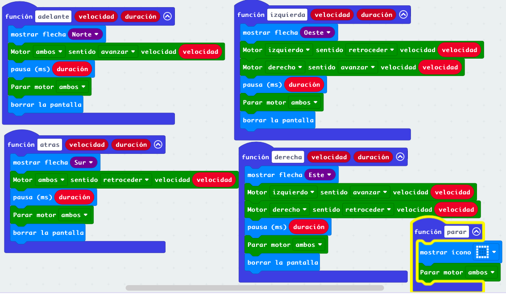
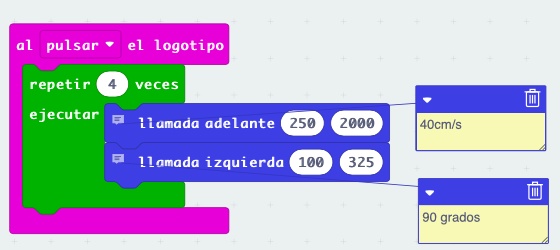
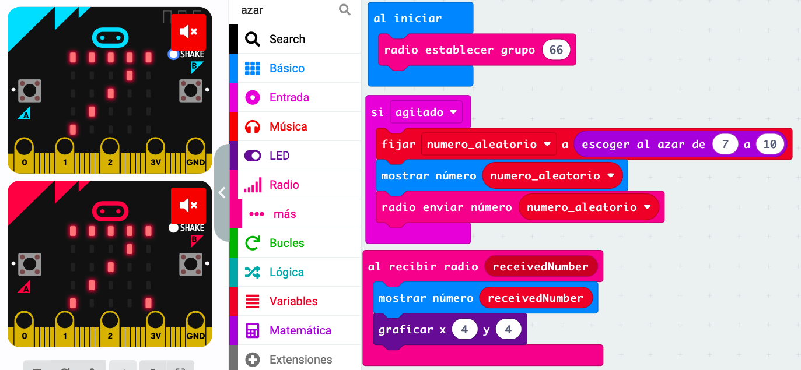
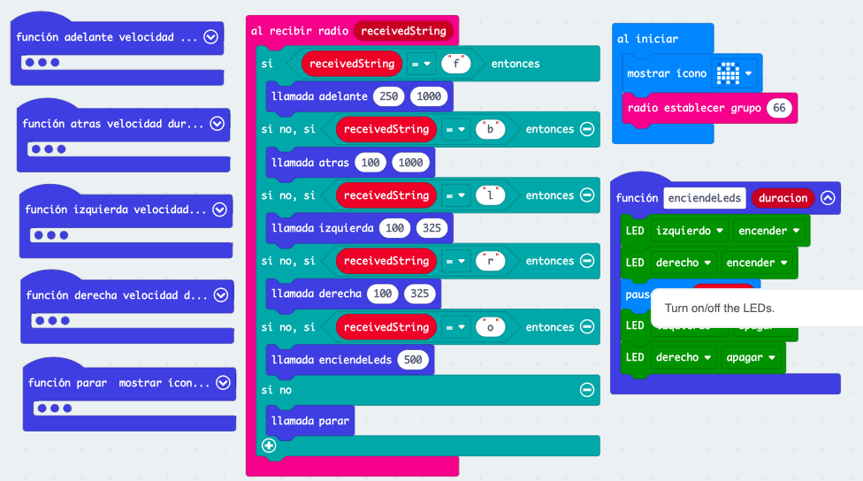
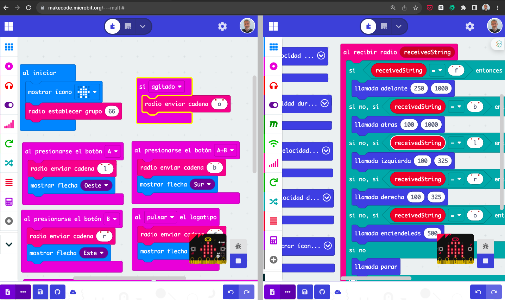
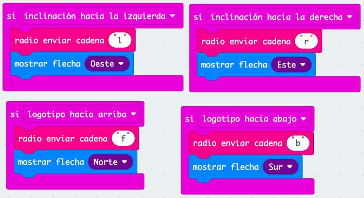
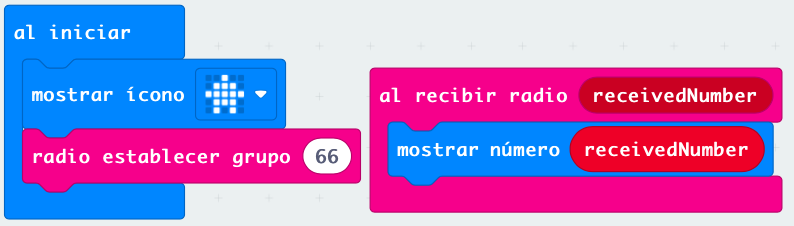
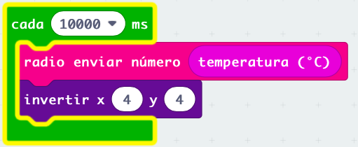

# Sesión 2 - funciones para control de robot Maqueen o similares

Vamos a crear Un conjunto de funciones que nos van a permitir controlar nuestro robot McQueen o similar.

Éstas funciones las podremos utilizar en distintos proyectos. Como MakeCode no permite la creación de librerías, lo que haremos será duplicar el proyecto de esta funciones y añadirle la funcionalidad extra.

## Funciones de movimiento

Vamos a crear cinco funciones básicas que controlarán el movimiento en las distintas direcciones de nuestro robot McQueen.

Vamos a crear cinco funciones básicas que controlarán el movimiento en las distintas direcciones de nuestro robot McQueen.

Cada una de estas funciones realizará el movimiento durante un cierto tiempo y con una velocidad dada. Para ello añadiremos dos argumentos que serán la velocidad y la duración de este movimiento. Pasado el tiempo de la duración detendremos todo movimiento.

Para controlar nuestro robot maqueen incluiremos la extensión Maqueen (o la correspondiente si es otro robot) en el proyecto.

Todas las funciones tienen el mismo formato:

* 2 argumentos: velocidad y duración.
* Mostraremos una imagen en pantalla mostrando la dirección del movimiento.
* Ejecutamos la orden correspondiente del movimiento de la extensión maqueen.
* Esperamos el tiempo correspondiente a la duración del comando.
* Paramos el movimiento. Es importante recalcar que hay que detener los movimiento, estos NO se detienen solos pasado el tiempo esperado.

### Ejercicio 1: movimiento como en coches de radiocontrol

Los movimientos que hemos utilizado están pensado para que el robot tenga un movimiento más preciso y sobre todo no se caiga de la mesa...

Podemos diseñar otro conjunto de funciones que no detengan el movimiento pasado un tiempo, sino que sea el propio usuario el que tenga que mandar la orden de parada. Para eso basta con eliminar la pausa y la orden de parar.

[Proyecto de funciones de movimiento del robot](https://makecode.microbit.org/S74033-29364-61141-16598)

### Ejemplo: dibujando un cuadrado

Podemos usar las funciones creadas para realizar movimientos complejos, por ejemplo, dibujar un cuadrado

También podíamos programar la solución de un laberinto...

## Usando la radio: jugando a los dados todos juntos

Vamos a jugar a los dados todos juntos, para ello crearemos un programa que genere un número aleatorio, lo muestre por pantalla y lo envíe por radio.

Dado que tenemos que usar el número aleatorio elegido para mostrarlo en pantalla y para enviarlo, crearemos una variable donde guardaremos su valor.

Por otro lado, al recibir un número por radio lo mostraremos en pantalla y para distinguir si es el número que nosotros hemos enviado o el que hemos recibido le añadiremos un puntito encendido en la pantalla para ello usaremos la órdenes directas de LED

[Proyecto dado por radio](https://makecode.microbit.org/S09070-63534-21721-99105)

Si no establecemos un grupo de radio, todas las microbits escucharán los mensajes, si asignamos un grupo, sólo recibirán aquellos de dentro del grupo.

## Robot controlado remotamente

Vamos a hacer un proyecto donde controlaremos nuestro maqueen remotamente vía radio usando otra micro:bit. Esta segunda micro Bit que actuará como mando enviará los distintos comandos el robot los procesará realizando la acción correspondiente a cada uno de ellos.  

En este proyecto tenemos que establecer cuál es eran los datos enviados por radio significarán los distintos comandos.

Pueden ser datos numéricos o de texto.

Parece más sencillo si utilizamos datos de texto correspondiente a la inicial de los distintos movimientos.

Usaremos F para avanzar de "forward" en inglés, B para ir hacia atrás de Backward, L y R para los movimientos de izquierda y derecha.

Hay que tener en cuenta que los comandos tienen que escribirse exactamente igual en el mando y en el robot que lo recibe no vale que uno sea en mayúscula y otra minúscula. 

En nuestro programa del robo, una vez recibamos un dato correspondiente a un comando, comprobaremos el valor de este comando y en función de los distintos comandos posibles ejecutaremos las acciones. Esto lo haremos con varias sentencias if/else if ...

Hemos añadido también una función que permite encender y apagar los LED con una duración determinada.

Al iniciar nuestro programa mostramos una imagen en la pantalla para saber distinguir nuestro robot en los demás y asignamos el grupo de radio correspondiente que compartirán robot y su mando correspondiente.

[Proyecto del robot v1](https://makecode.microbit.org/S35595-61211-20888-06578)

## Multieditor

Cuando trabajamos con proyectos donde se emplean comunicaciones, resulta cómodo utilizar la versión multi editor de MakeCode, que nos permite abrir dos proyectos al mismo tiempo estableciendo una comunicación de radio entre ambos.

Para ello entramos en [https://makecode.microbit.org/---multi#](https://makecode.microbit.org/---multi#)

También podemos acceder desde la página inicial de makecode en el ejemplo "multieditor"

Ahora podemos abrir en un lado el mando y en otro el programa del robot, y podemos probar que funciona la lógica de las comunicaciones

## Mando

En el proyecto del mando lo que haremos será detectar las acciones del usuario que implican el envío de los diferentes comandos usaremos los botones, el logo y la diferente inclinación es posible de la placa micro Bit

[Programa mando v1](https://makecode.microbit.org/S49448-99936-47185-23078)

También podemos usar las diferentes inclinaciones de la micro Bit para que se transmitan los diferentes comando.

También podemos usar las diferentes inclinaciones de la micro:bit para que se transmitan los diferentes comandos:

* Inclinando hacia delante avanza
* Inclinándola hacia atrás retrocede 
* inclinándola a izquierda y a la derecha girará respectivamente

### Ejercicio 2: indicadores luminosos

Se propone usar los leds rojos delanteros para indicar el movimiento:

* Ambos fijos encendidos al avanzar
* El izquierdo y el derecho encendidos al girar en la respectivas direcciones

## Enviando datos desde el robot

Ahora vamos a hacer que nuestro robot envíe datos al mando, es lo que se conoce como telemetría.

Empezaremos enviando el dato de temperatura que el mando mostrará en la pantalla

En el mando sólo tenemos que mostrar en la pantalla el dato que recibamos

[Programa mando v2](https://makecode.microbit.org/S25294-09430-10433-84022)

En el robot enviaremos el dato de temperatura cada 10 segundos e invertiremos el pixel (4,4) de la pantalla para saber que ya se ha enviado.

[Programa robot v2](https://makecode.microbit.org/S11895-92138-67941-14484)

