# Sesión 3 - microbit + electrónica

## Maqueen a fondo

[Documentación dfrobot](https://wiki.dfrobot.com/micro_Maqueen_for_micro_bit_SKU_ROB0148-EN)

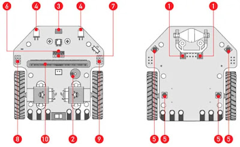

1. Sensor de línea: 2 sensores digitales blanco y negro (Niveles alto y bajo)
2. Buzzer: Tonos y música para tu proyecto
3. Infrarrojo: Receptor infrarrojo para controlar tu Maqueen (Decodificador NEC)
4. LEDs indicadores frontales: 2  LEDs color rojo difuso
5. LEDs RGB multicolor de ambiente: 4 LEDs capaces de hacer hasta 16 millones de colores
6. Sensor de distancia ultrasónico: 1SR04, SR04P (5V)
7. Conector para comunicación I2C: sólo funciona con 3.3V
8. Puertos para servomotor: 2 líneas
9. Conector para pines digitales multipropósito
10. Conector para micro:bit

## Componentes y conexiones maqueen

Podemos usar los conectores que incluye maqueen para añadir componentes como servos u otros sensores.

Si conectamos un servo a los pines S1 o S2 lo controlaremos con la extensión de maqueen

Vamos a hacer un sencillo programa donde indicaremos visualmente con un servo si tenemos algún obstáculo cerca, usando un servo para mover el indicador

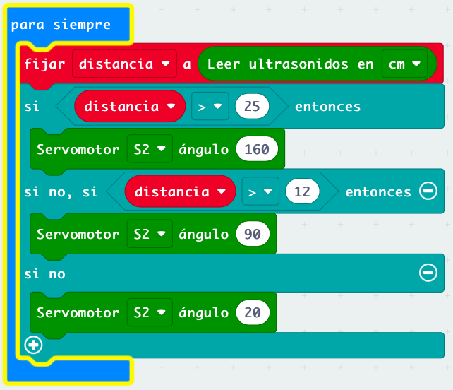

[Programa](https://makecode.microbit.org/S99517-55263-89648-23199)

## Pinout

Veamos las conexiones de la micro:bit

v2

v1

Todos los pines azules son programables y funcionan como entrada/salida digitales. 

Algunos de ellos son capaces además de actuar como entradas digitales

Y otros están preparados para que conectemos otros dispositivos usando comunicaciones I2C o SPI.

[Detalles](https://tech.microbit.org/hardware/edgeconnector/)

Es openSource [Esquema electrónico](https://tech.microbit.org/hardware/schematic/)

## Extensor

Es una placa que conectamos a la micro:bit y nos facilita la conexión de otros dispositivos electrónicos.

Tipos y variedades:

* Para cables con pinzas/cocodrilos

Existen kits con este tipo de conexión y con todo tipo de componentes, como [los de MonkMakes](https://monkmakes.com/products.html)

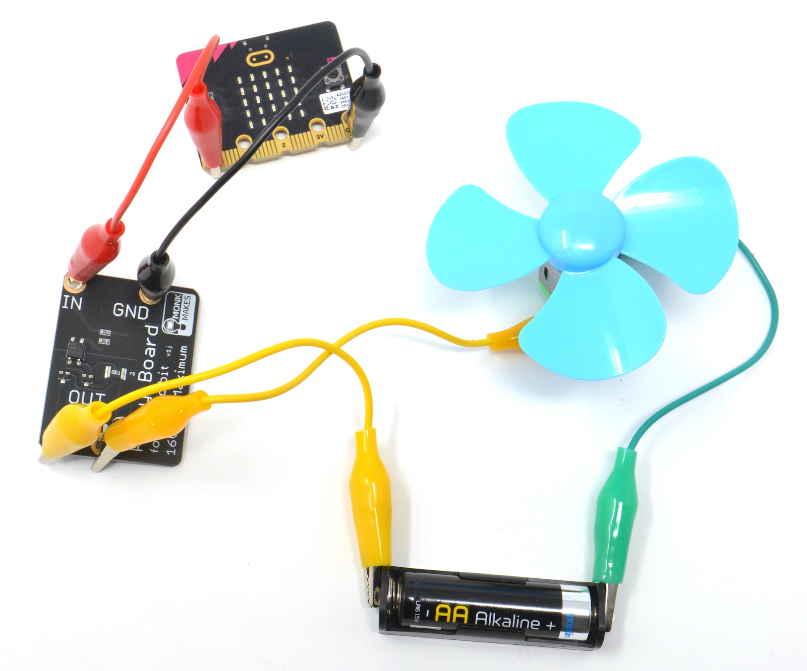

 * Para los típicos cables con conectores Dupont

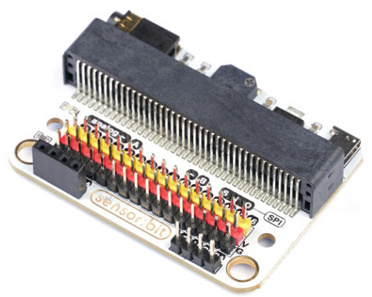

* para facilitar la conexión de la micro:bit con una protoboard

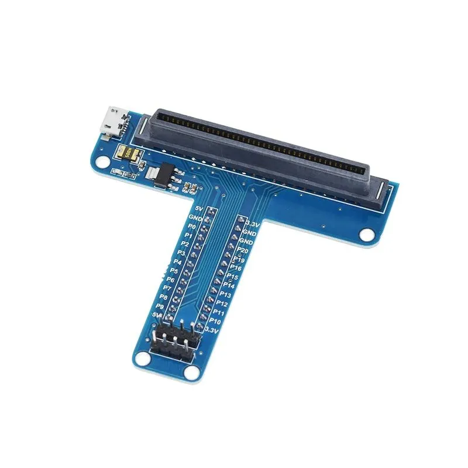

* Para controlar motores

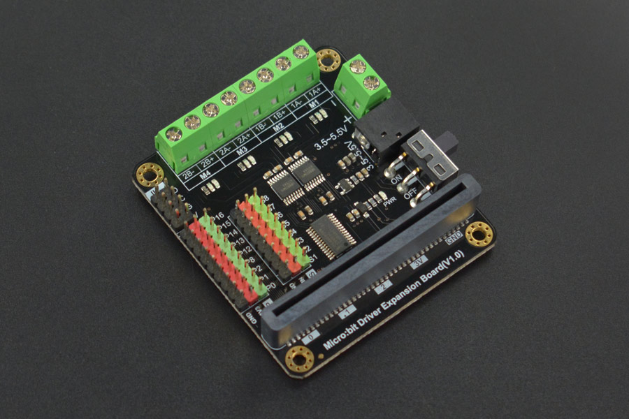

[Extensor Keyestudio KS0360 Sensor shield v2](https://wiki.keyestudio.com/Ks0360_Keyestudio_Sensor_Shield_V2_for_BBC_micro:bit)

Será el extensor con el que trabajaremos

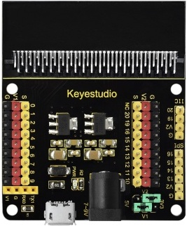

[Más detalle](./images/KS0360_1500px.jpeg)

La mayoría de estas placas incluyen un esquema de conexión formado por grupos de 3 patillas:

* Rojo: alimentación/positivo/Vcc
* Negro: GND/negativo/masa
* Amarillo: señal que controla o lee el dispositivo que conectamos 

### Alimentación

La micro:bit no es capaz de alimentar nuestros proyectos, con lo que debemos de alimentar el extensor.
Podemos elegir entre alimentarlo con su USB o con el conector de alimentación entre 7V y 9V

El extensor tiene 2 zonas de alimentación V1 correspondiente a los conectores del lado izquierdo y V2 en el lado derecho

Los jumper de la zona de abajo a la derecha permiten seleccionar si alimentamos los conectores de cada zona con 3.3V o con 5V, según las necesidades.

## LCD

Vamos a usar una pantalla LCD que conectamos a la micro:bit a través del extensor.

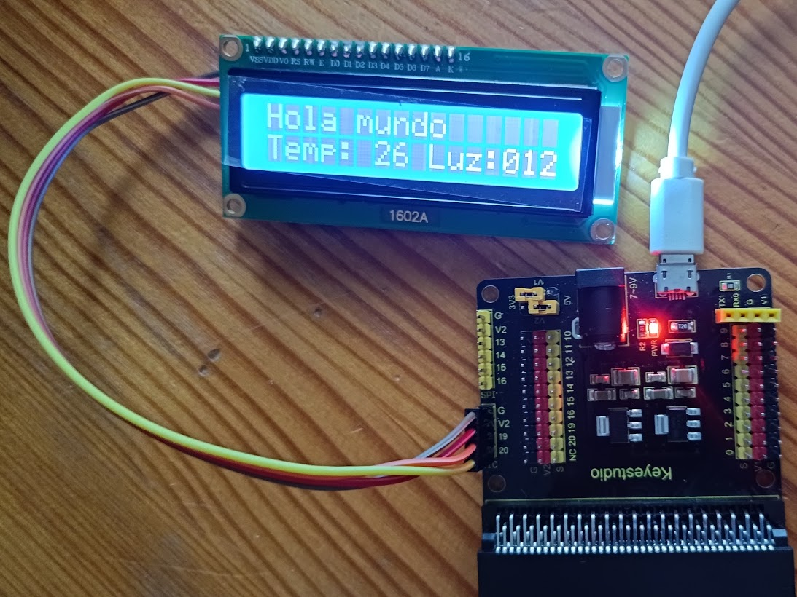

Este LCD usa conexión I2C que sólo requiere de 4 cables: Vcc, GND, SDA y SCL.

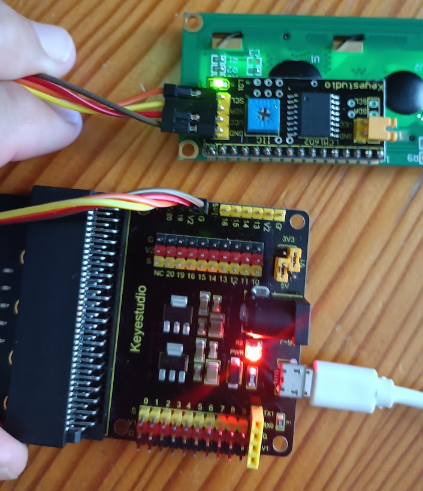

Uniremos los cables correspondientes, podemos ver los nombres de los pines en la parte de abajo del extensonr y en el LCD. Tenemos que asegurarnos de que la alimentación de V2 es de 5V para lo que comprobaremos los jumpers de alimentación.

Añadimos la extensión LCD1602I2C que nos permitirá mostrar datos con falicidad

Primero hay que inicializar la pantalla indicando la dirección (address) de nuestra placa, 39 (o 0x27 en hexadecimal).

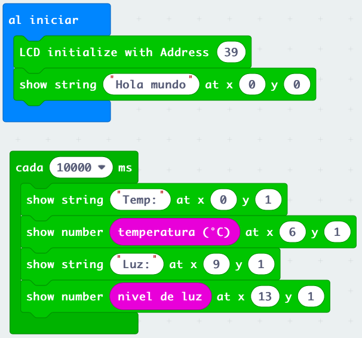

### Extensión makerkit

Esta extensión nos permite crear caracteres de usuario

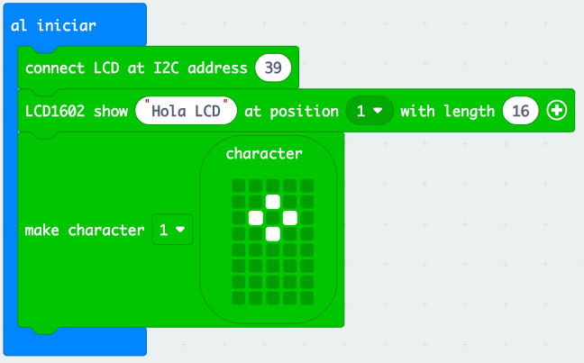

Mostramos los datos y los carateres de usuario

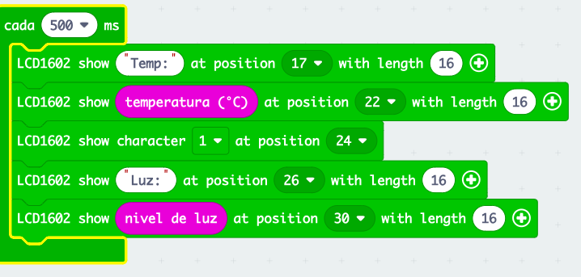

Otra de las ventajas de esta librería es que nos facilita el cálculo de la posición y la confección de las pantallas

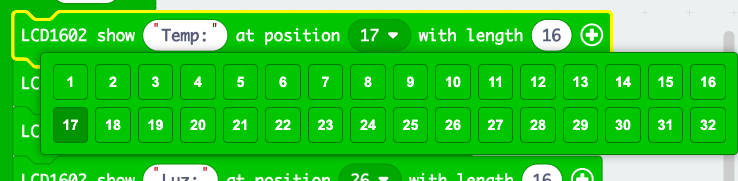

[Proyecto](https://github.com/javacasm/Robotica-microbit-III/tree/main)