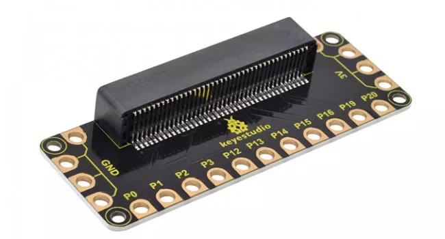

# Sesión 3 - microbit + electrónica

## Maqueen a fondo

[Documentación dfrobot](https://wiki.dfrobot.com/micro_Maqueen_for_micro_bit_SKU_ROB0148-EN)

1. Sensor de línea: 2 sensores digitales blanco y negro (Niveles alto y bajo)
2. Buzzer: Tonos y música para tu proyecto
3. Infrarrojo: Receptor infrarrojo para controlar tu Maqueen (Decodificador NEC)
4. LEDs indicadores frontales: 2  LEDs color rojo difuso
5. LEDs RGB multicolor de ambiente: 4 LEDs capaces de hacer hasta 16 millones de colores
6. Sensor de distancia ultrasónico: 1SR04, SR04P (5V)
7. Conector para comunicación I2C: sólo funciona con 3.3V
8. Puertos para servomotor: 2 líneas
9. Conector para pines digitales multipropósito
10. Conector para micro:bit

## Pinout

v2

v1

[Detalles](https://tech.microbit.org/hardware/edgeconnector/)

Es openSource [Esquema electrónico](https://tech.microbit.org/hardware/schematic/)

## Componentes y conexiones maqueen

## Extensor

Tipos y variedades:

* Para cables con pinzas/cocodrilos

Existen kits con todo tipo de componentes, como [los de MonkMakes](https://monkmakes.com/products.html)

para cables

para protoboard

con motores

[Extensor Keyestudio KS0360 Sensor shield v2](https://wiki.keyestudio.com/Ks0360_Keyestudio_Sensor_Shield_V2_for_BBC_micro:bit)

[Más detalle](./images/KS0360_1500px.jpeg)

### Alimentación

USB o power

## LCD

Añadimos la extensión 

Primero hay que inicializar la p

### Extensión makerkit

Crear caracter de usuario

Mostramos los datos y los carateres de usuario

Otra de las ventajas de esta librería es que nos facilita el cálculo de la posición y la confección de las pantallas

[Proyecto](https://github.com/javacasm/Robotica-microbit-III/tree/main)