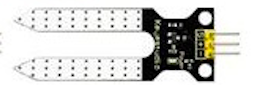

# Proyectos

## Sistema de riego

Vamos a crear distintas versiones del sistema de riego que irán añadiendo progresivamente más funcionalidad. Todas las versiones las crearemos una a partir de la otra para que así vayan heredando lo que ya hemos construido

### Riego v1: manual

Vamos a hacer un sencillo sitema de riego que activará una bomba de riego.

Para que nuestra micro:bit pueda controlar la bomba tenemos que usar un relé que permite manejar la potencia necesaria

En la [documentación del kit](https://wiki.keyestudio.com/KS0361(KS0365)_keyestudio_37_in_1_Starter_Kit_for_BBC_micro:bit#Project_20:_Relay) podemos ver los detalles técnicos del relé

Usaremos el pin 16 de forma digitalpara activar o desactivar el riego mediante el relé

(En el esquema se puede ver otro modelo de extensor más sencillo, pero se usan los pines correctos)

En el programa usaremos un par de funciones para activar/desactivar el riego y las llamaremos desde los eventos de pulsación de los botones A y B

[Riego manual v1](https://makecode.microbit.org/S43900-35599-04927-24424)

### Riego v1.5: manual y remoto

Vamos a añadir la opción de controlar remotamente el sistema de riego desde otra placa.

Para ello comprobaremos los mensajes de radio que nos llegan y en función del texto recibido activaremos o apagaremos el sistema

[Riego remoto v1.5](https://makecode.microbit.org/S45351-14854-30778-42995)

Debemos crear un programa que la controle en la otra micro:bit. En este caso vamos a enviar una cadena de texto que deberá ser idéntica en el mando y en el sistema de riego. Puede tener una longitud de hasta 6 caracteres

[Control remoto riego](https://makecode.microbit.org/S12056-56719-35859-14900)

Podemos usar varias placas para regar independientemente varios sectores

### Riego v2: LCD con temperatura y luz 

Conectamos una pantalla LCD para mostrar los datos de temperatura y luz ambiente. 

Para ello sólo tenemos que asegurarnos de que alimentamos la pantalla LCD a 5V y que conectamos los pines 19 y 20 del extensor con SCL y SDA.

* Añadimos la extensión del LCD
* Copiamos las líneas de código del programa que hicimos para mostrar los datos de luz y temperatura en el LCD.
* Cambiamos el mensaje de bienvenida y añadimos líneas en las funciones "enciendeRiego" y "apagaRiego" para que se muestre en el LCD si el riego está encendido o apagado

[Riego con LCD v2](./images/programa_riego_lcd_v2.png)

### Riego v3: temporización

Vamos a añadir la posibilidad de que el riego se active por tiempo, usaremos un bucle de tiempo y le daremos una duración al riego usando un bloque "pausa" que determinará el tiempo está regando no pasa nada no te preocupes

[Sistema riego temporizador v2](https://makecode.microbit.org/S95727-06891-25643-25264)

### Riego v4: sensores

Ahora vamos a medir el la humedad del suelo y en función del valor activaremos o no el sistema de riego

Lo conectamos a un pin analógico, como el P0, alimentándolo a 3V

Tendremos que calibrar el sensor de humedad en nuestro terreno, viendo los valores máximos y mínimos que miden. Vamos a suponer que está entre 0 (totalmente seco) y 200 (empapado)

En el programa añadimos un bucle temporal para que cada minuto:

* Se mida el valor analógico de P0
* Convertimos el valor medido a un porcentaje que guardamos en una variable "humedad"
* Si el valor de "humedad" es menor que 50% encendemos el riego
* Si es mayor lo apagamos

[Programa completo](https://makecode.microbit.org/S88126-45118-97926-11783)

### Mejoras

* Añadir un sensor para medir el nivel de agua del depósito. Podemos usar:

    * Un sensor de ultrasonido para ver la altura del agua
    
    * Un sensor de nivel de agua
     [Ejemplo de la documentación del kit](https://wiki.keyestudio.com/KS0361(KS0365)_keyestudio_37_in_1_Starter_Kit_for_BBC_micro:bit#Project_31:_Water_Level_Alarm)
